# 📊 Flujo de Funcionamiento - Martina Bescós App

## 🏗️ Arquitectura General del Sistema

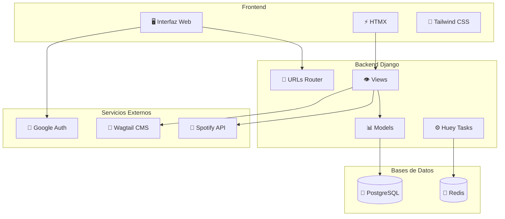

## 🎯 Módulos Principales

### 1. 📚 Sistema de Evaluaciones (`evaluations`)

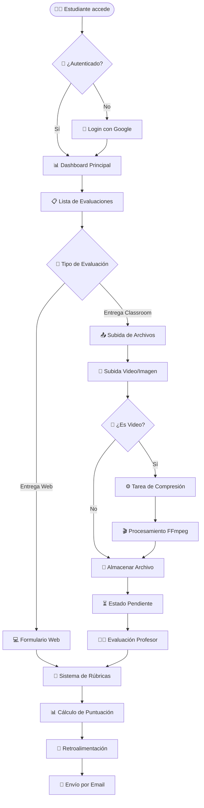

#### 🔄 Estados de Evaluación

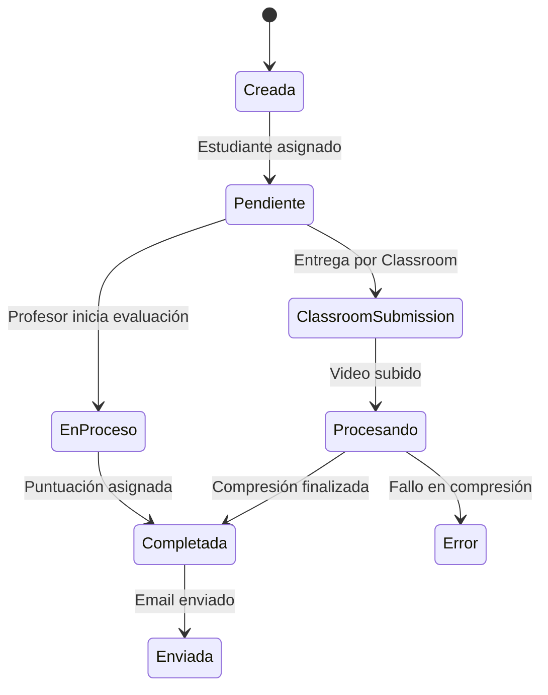

### 2. 🎵 Sistema de Ranking de Canciones (`songs_ranking`)

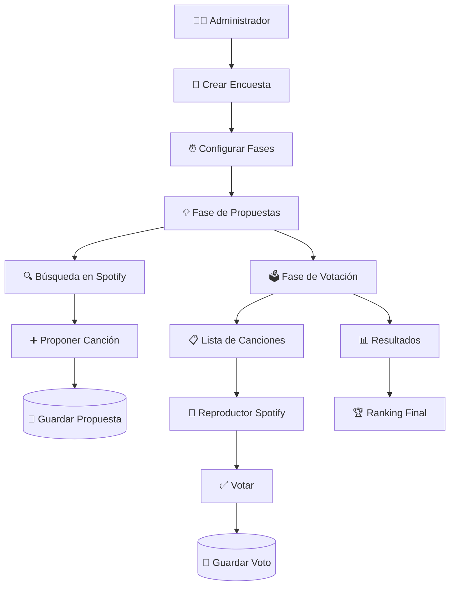

#### 📅 Fases de la Encuesta

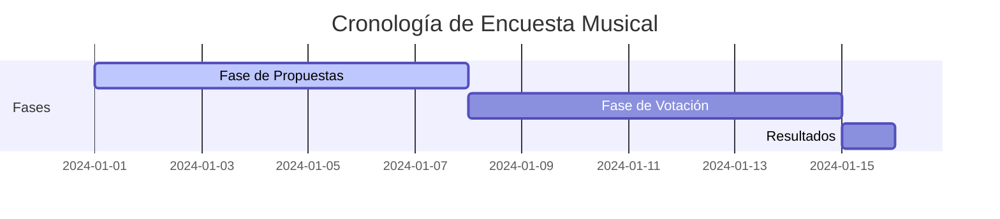

### 3. 🔑 Sistema de API Keys (`api_keys`)

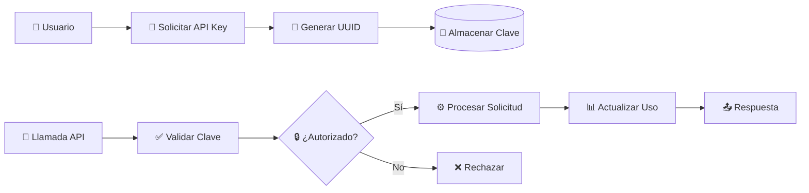

### 4. 📰 Sistema CMS (`cms` - Wagtail)

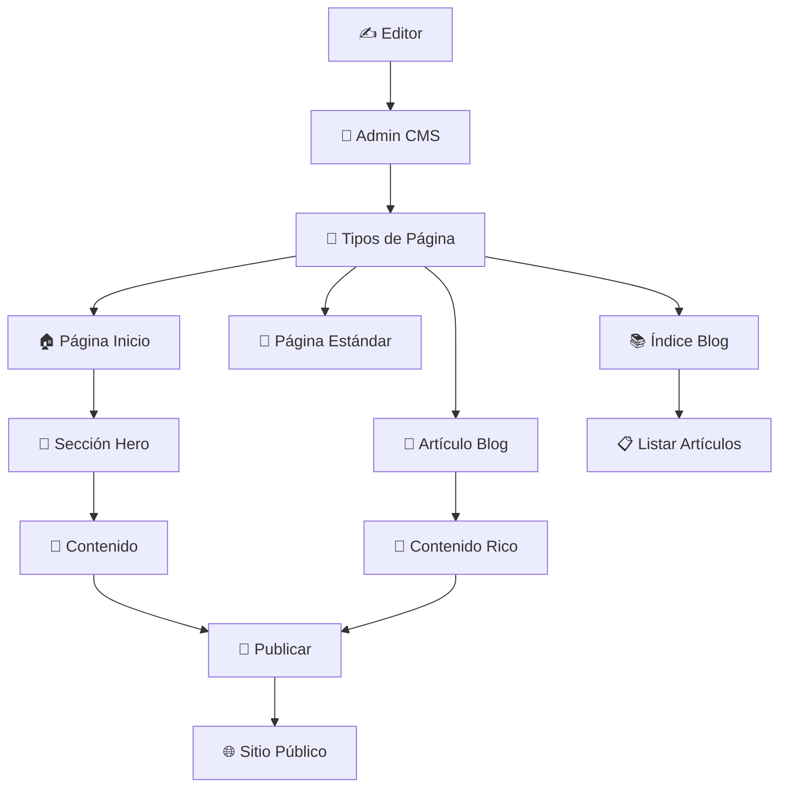

## 🔐 Sistema de Autenticación

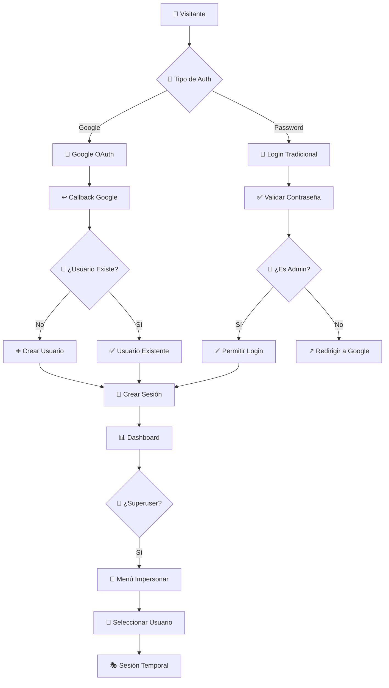

## 📊 Flujo de Datos Completo

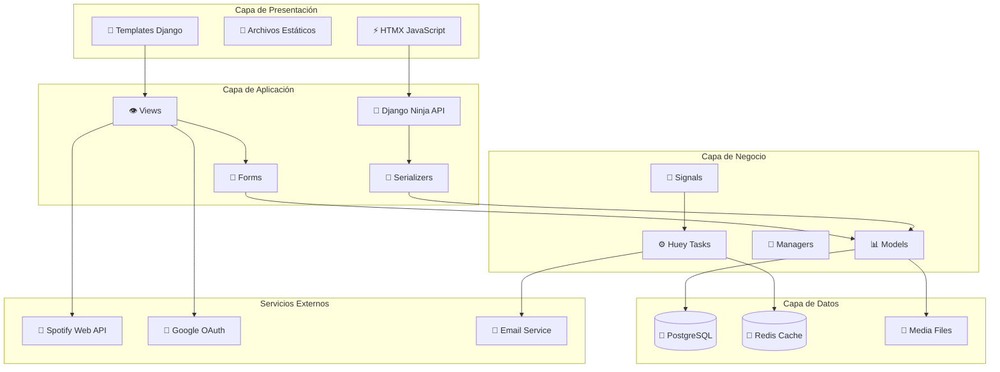

## 🔄 Procesos Asíncronos (Huey)

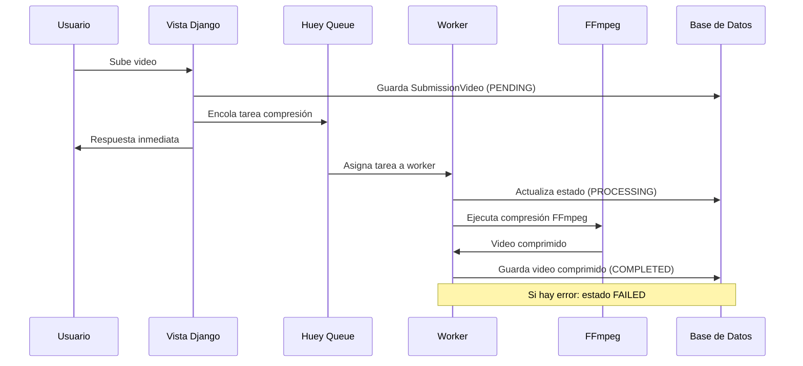

## 🎯 Casos de Uso Principales

### 📝 Evaluación de Estudiante

1. **Estudiante accede** → Login con Google
2. **Ve evaluaciones pendientes** → Selecciona evaluación
3. **Tipo de entrega**:
   - **Web**: Completa formulario con rúbricas
   - **Classroom**: Sube archivos (video/imagen)
4. **Procesamiento**: Videos se comprimen automáticamente
5. **Profesor evalúa** → Asigna puntuaciones por rúbricas
6. **Retroalimentación** → Se envía por email

### 🎵 Encuesta Musical

1. **Admin crea encuesta** → Define fases temporales
2. **Fase propuestas**: Usuarios buscan y proponen canciones
3. **Fase votación**: Usuarios escuchan y votan canciones
4. **Resultados**: Se muestra ranking final

### 📰 Gestión de Contenido

1. **Editor accede a CMS** → Wagtail Admin
2. **Crea/edita páginas** → Diferentes tipos disponibles
3. **Publica contenido** → Visible en sitio público

## 🛠️ Tecnologías Utilizadas

- **Backend**: Django 4.x + PostgreSQL
- **Frontend**: HTMX + Tailwind CSS
- **CMS**: Wagtail
- **API**: Django Ninja
- **Autenticación**: Django Allauth + Google OAuth
- **Tareas Asíncronas**: Huey + Redis
- **Procesamiento Video**: FFmpeg
- **Servicios Externos**: Spotify Web API

## 📈 Métricas y Monitoreo

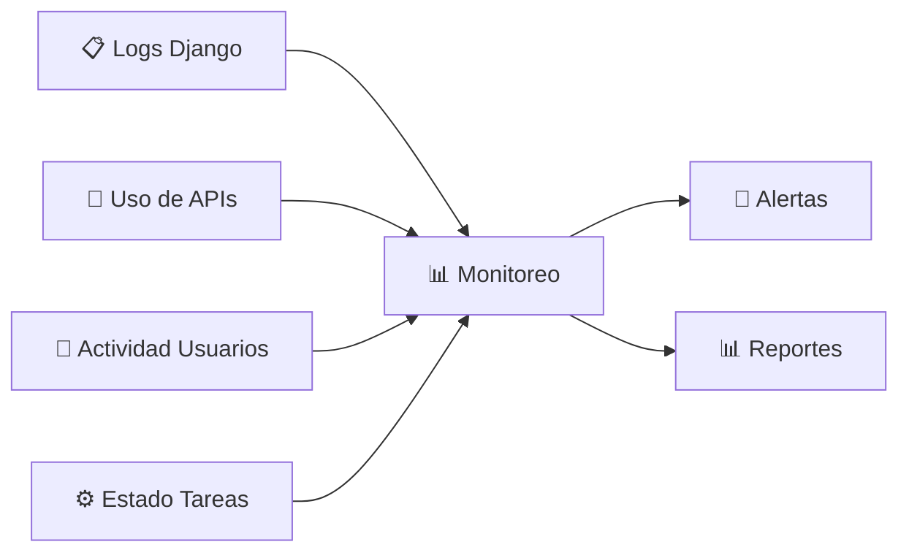

---

*Este diagrama representa el flujo completo de funcionamiento de la aplicación Martina Bescós, mostrando la interacción entre todos los módulos y sistemas integrados.*
