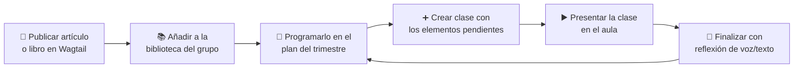

# Martina Bescós App

Plataforma open source para educación musical construida con **Django** y **Wagtail**, pensada para profesorado y alumnado de música.

## ¿Qué permite hacer?

La aplicación cubre el ciclo completo de trabajo de un profesor de música:

1. **Publicar contenido**: canciones con tutoriales en vídeo, PDFs, audios e imágenes como artículos de blog; partituras con metadatos; libros organizados en capítulos.
2. **Organizar bibliotecas**: cada recurso (imagen, PDF, audio, embed o página completa) puede añadirse a la biblioteca personal o a las bibliotecas de grupo.
3. **Preparar y dar clases**: las sesiones de clase se componen con elementos de esas bibliotecas y se presentan a pantalla completa en el aula.
4. **Programar el trimestre**: los planes de programación permiten secuenciar artículos, libros y partituras, ver el progreso real de cada grupo y crear la siguiente clase con un clic.
5. **Reflexionar y evaluar**: al finalizar cada clase se puede grabar una reflexión (texto o voz), y el módulo de evaluaciones gestiona rúbricas y entregas.

## Mapa rápido

| Quiero... | Ir a |
|---|---|
| Dar mis primeros pasos como profesor | [Primeros pasos](profesor/primeros-pasos.md) |
| Crear artículos, libros o partituras | [Contenidos](profesor/contenidos.md) |
| Entender las bibliotecas | [Bibliotecas](profesor/bibliotecas.md) |
| Preparar y presentar una clase | [Clases](profesor/clases.md) |
| Planificar un trimestre y seguir el progreso | [Programaciones](profesor/programaciones.md) |
| Montar el entorno de desarrollo | [Desarrollo local](tecnica/desarrollo.md) |
| Entender la arquitectura | [Arquitectura](tecnica/arquitectura.md) |

## Flujo de trabajo típico

El sistema calcula automáticamente qué parte de cada artículo o libro ha visto ya cada grupo, y recomienda el siguiente paso.
