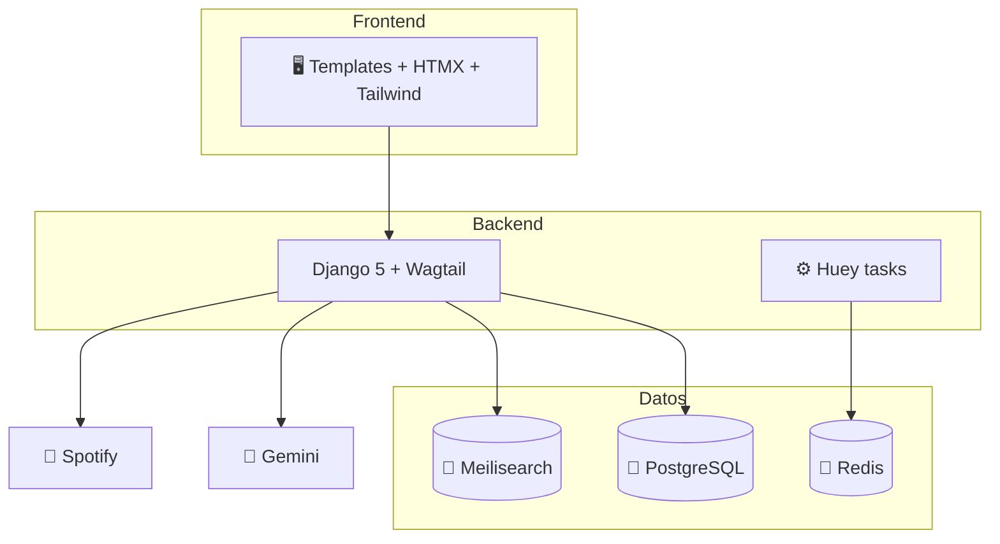
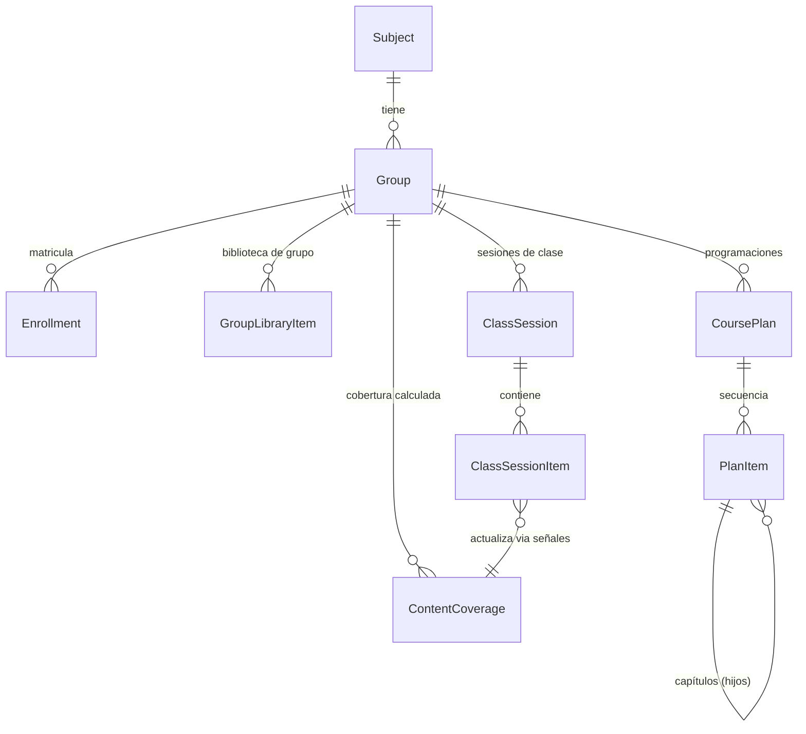

# Arquitectura

Proyecto Django 5 basado en [cookiecutter-django](https://github.com/cookiecutter/cookiecutter-django), con Wagtail como CMS.

## Stack

- **Backend**: Django 5, Wagtail, django-allauth (Google), django-ninja (API), Huey (tareas en background).
- **Frontend**: templates Django + HTMX + Tailwind CSS (daisyUI). Sin SPA.
- **Datos**: PostgreSQL, Redis (caché y cola de Huey), Meilisearch (búsqueda full-text de content_hub).
- **Servicios externos**: Google (auth), Spotify API (songs_ranking), Google Gemini (publicación asistida por IA y feedback de evaluaciones).
- **Infra**: Docker Compose (local, stage y production), whitenoise para estáticos.

## Patrones del proyecto

- **FAT MODEL, TINY VIEW**: la lógica de negocio vive en los modelos (y en `services.py` cuando cruza apps); las vistas solo orquestan y renderizan.
- **GenericForeignKey como pegamento**: bibliotecas, sesiones de clase y programaciones referencian cualquier contenido (páginas Wagtail, Documents, Images, Embeds) mediante `ContentType` + `object_id`.
- **Trazabilidad del origen**: `ClassSessionItem.source_page` guarda desde qué página se añadió cada elemento. Sobre esto se construye la cobertura de las programaciones.
- **Tablas heredadas**: varias tablas conservan el prefijo `evaluations_` (`db_table`) por compatibilidad histórica, aunque los modelos vivan en `clases`.

## Relación entre los conceptos principales

