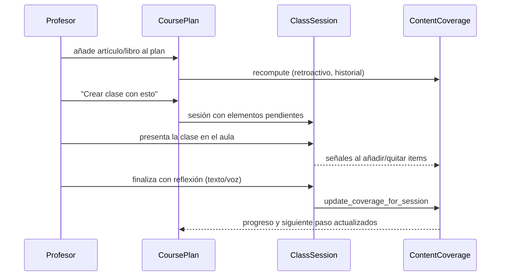

# App `programacion` en detalle

Planificación de trimestres con cálculo automático de progreso por grupo.

## Modelos

### CoursePlan

Un plan por grupo y periodo. Campos: `teacher`, `group`, `name`, `start_date`, `end_date`, `is_active`. Métodos clave: `get_items_ordered()`, `get_progress()` (media de items de primer nivel), `get_next_step()` (primer item incompleto, entrando en capítulos), `reorder_items()`.

### PlanItem

Recurso programado. GenericFK al contenido (`BlogPage`, `BlogIndexPage`, `ScorePage`...), `parent` a sí mismo para capítulos, `order`, `sessions_estimate` y `status`:

- `auto`: el progreso sale de la cobertura calculada.
- `done`: completado manual (100%).
- `skipped`: excluido del plan (no computa).

`sync_chapters()` crea hijos para los `BlogPage` publicados bajo un libro. `get_progress()` resuelve: manual → media de hijos → cobertura.

### ContentCoverage

Cobertura de una página por grupo: `elements_total`, `elements_seen`, `seen_element_keys` (JSON con claves `"modelo:pk"`), `page_presented`, `last_session`. Única por `(group, content_type, object_id)`. `percent` devuelve 0-100 (100 si la página sin elementos se presentó entera).

## Servicios (`services.py`)

- `get_page_elements(page)`: enumera los elementos "añadibles a sesión" de una página — adjuntos del StreamField de `BlogPage` (PDFs, audios, vídeos, imágenes) o bloques del `content` de `ScorePage` (incluidos embeds resueltos contra `wagtail.embeds.Embed`).
- `get_seen_keys(group)`: claves de todo lo que el grupo ha visto en cualquier sesión. *Decisión de diseño*: no se filtra por `source_page` — si el grupo vio ese documento en cualquier contexto, cuenta. Para atribución estricta, filtrar aquí por página de origen.
- `recompute_coverage(group, page)`: recalcula y persiste la cobertura. **Retroactivo**: funciona sobre el historial completo de sesiones.
- `update_coverage_for_session(session)`: recalcula todas las páginas tocadas por una sesión (se llama al cerrar la clase).
- `create_session_from_plan_item(...)`: crea una `ClassSession` con los elementos pendientes del item (guarda `plan_item_id` en `metadata`).

## Señales (`signals.py`)

`post_save` y `post_delete` de `ClassSessionItem` recalculan la cobertura de la página de origen del elemento (y de la propia página si el item es una página completa). Registradas en `ProgramacionConfig.ready()`.

## Flujo completo



## Tests

`programacion/tests.py` cubre enumeración de elementos, cobertura vía señales, retroactividad, progreso y siguiente paso del plan, sincronización de capítulos, creación de sesión desde el plan y cierre/reapertura de sesiones. En sqlite ejecutar con `--no-migrations` (una migración antigua de cms usa SQL específico de Postgres):

```bash
pytest programacion/tests.py --no-migrations
```
